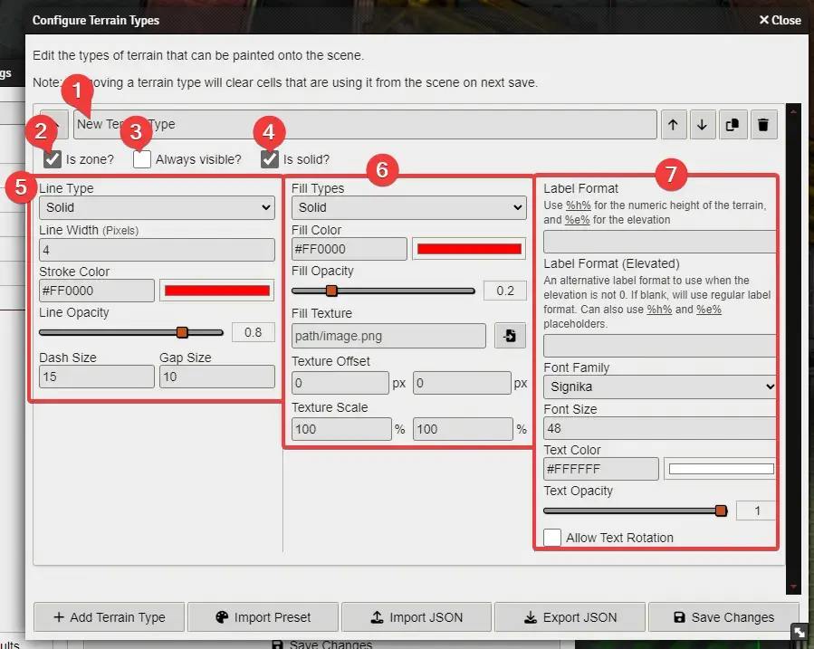
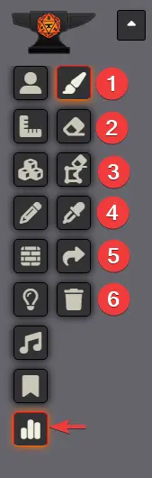
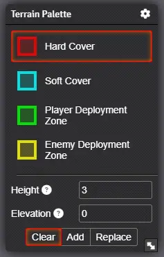
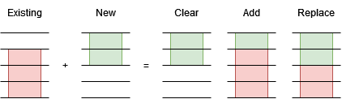
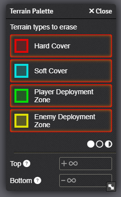

# Getting Started (GMs)

First off, thank you for installing/checking out Terrain Height Tools! Hopefully you and your players will find this module useful. Don't hesitate to reach out on Discord if you have any issues.

---

### Configuring Terrain Types

The first you will need to do after installing THT, is to configure your terrain types. A terrain type is what you will be painting on the terrain and each terrain type will have it's own style and label. For example, if you are playing Lancer, you may have a terrain type for "Hard Cover", one for "Soft Cover" and one for the "Player Deployment Zone".

Open the Foundry settings window and click THT's "_Configure Terrain Types_" button. This will open a window which will be empty by default.

> [!TIP]
> If you just want to quickly get started you can click the "_Import Preset_" button to load a preset which contains terrain types already set up for you. At the moment THT only have a Lancer preset, but if you would like to share more please raise an issue or pull request on GitHub or reach out to me on Discord.

You just need to click on the "_Add Terrain Type_" button at the bottom, and then you'll be presented with an array of options to tweak your terrain type.

Here are some of the important controls and configuration options you need to know:

1. Shows you a list of all terrain types that have been created. Use the "_Add Terrain Type_" button at the bottom of the window to add more.
2. Gives a few controls for the terrain type. From left to right:
	1. Move up (this affects the order they will be shown in the palette)
	2. Move down
	3. Duplicate
	4. Delete
3. This is the name of the terrain. This is how it will appear to you in the list when you are painting terrain, and how it will appear to players in the [Terrain Viewer](../readme.md#terrain-viewer); But NOT how it will appear on the scene canvas.
4. Use these tabs to switch between different configuration options.
5. The controls in this area will change depending on the selected tab. This preview is showing the "_Lines_" settings.

- On the "_Text_" tab, there is a "_Label Format_" setting. This is where you will specify what the label will be when the terrain is drawn to the scene. You can use placeholders which will get replaced with metadata from the terrain. For example, if you set the label to be `%e% + H%h%`, then when this terrain type is painted with an elevation of 2 and a height of 3, the label would be `2 + H3`.
	- `%h%` will be replaced with the height of the terrain (how big it is vertically)
	- `%e%` will be replaced with the elevation of the terrain (how high above the ground it is)
	- `%t%` will be replaced with the elevation of the top of the terrain (height + elevation)
- There is also a "_Elevated Label Format_" option, which is the same as above but is used instead when the terrain is at a non-zero elevation. If left blank, the normal label format will always be used. For example, you might create a type which has the label format `H%h%` and an elevated format of `%e%+H%h%` - meaning that the elevation would only show when the terrain is elevated.

> [!TIP]
> THT comes with a diagonal line texture for filling shapes. It can be found at `modules/terrain-height-tools/textures/hatching.png`.

---

### Painting the Scene Canvas

Now that you have configured your terrain types, you can start painting your maps with terrain!

First, open the Terrain Height Tools controls from the Foundry toolbox (it's icon looks like a bar chart).

You will be presented with six buttons:

#### 1. Paint

This is the tool that allows you to mark terrain on your map. When you select this tool, you will be presented with the terrain palette window.

You will need to select which terrain type to paint on the map, and if it is not a zone you can also set the height and elevation of that terrain.

> [!NOTE]
> Height is how big the terrain actually is; elevation is how high off the ground it is.

The _Clear/Add/Replace_ buttons are for determining how your paint brush interacts with terrain that already exists on the map.
- _Clear_ will wipe clean any cells that you paint. This means that only your newly-painted terrain will be there. This is how THT operated prior to v0.4.0.
- _Add_ will merge your new terrain with the existing terrain without overwriting it.
- _Replace_ will merge you new terrain with the existing terrain, overwriting anything that overlaps.

Then, just click and drag on the map to draw the terrain in the cells! Terrain will automatically merge with adjacent terrain that is of the same type, elevation and height.

#### 2. Erase

The erase tool allows you to erase certain cells from the map.

The palette for the eraser is similar to the paint palette, but works slightly differently.

By default, when you click this tool it will erase everything from the cells that you click on.

You can toggle individual terrain types on or off. If a terrain type is turned off, it won't be erased. You can use the cicle icons at the bottom of the list to toggle all types on, off or invert the selection respectively.

You can also specify a range to delete by providing either a top and/or a bottom value. Anything between these two values is deleted (zones will always be deleted regardless of the values here). This will effectively allow you to carve areas out of the terrain too!

Together, these filters allow you to specify exactly what should and shouldn't be deleted.

#### 3. Erase Shape

This tool provides a quick way of erasing an entire shape from the canvas. Select the tool, then click on a cell containing a shape to remove it. If there are multiple terrains in the cell you clicked, you will be asked which one you wish to delete.

#### 4. Copy Terrain Configuration

This tool allows you to copy the configuration (terrain type, height and elevation) of a shape that has already been created. Click on the tool, then click on a cell containing a shape to copy its configuration. If there are multiple terrains in the cell you clicked, you will be asked which one to copy from.

#### 5. Convert Shapes to Drawings/Walls

This tool allows you to convert a terrain shape to a Foundry drawing or a set of Foundry walls.

Clicking on the tool will open a window that allows you to choose which conversion should happen, and whether you wish to erase the shape after converting it.

Click on a shape to convert it. If there are multiple shapes where you clicked, you will be asked which one you wish to convert.

Note that when converting to a Foundry shape, the label may move. This is because Foundry always places the label at the geometric center of the shape, but THT tries to be a bit clever about the placement. If you don't like where the label is after converting, the easiest solution is to edit the shape, remove the label; then create a separate label which you can position independently.

#### 6. Clear Height Map

This button is the nuclear option for terrain erasure. Every terrain on the map will be deleted! (Don't worry, you'll be asked to confirm first).

---

### Automatic Token Elevation Change

I won't go into detail about all the options for tweaking THT here ([but I will over here](./settings-keybinds-reference.md)), howver this feature is worth mentioning.

With '_Automatic Token Elevation Change_' turned on, when someone moves a token around, the elevation of the token will automatically change with respect to the terrain underneath them.

For tokens that are already on the ground, they will remain on the "ground". E.G. a token on the ground that moves over a H2 terrain will have it's elevation set to 2.

Flying tokens will attempt to maintain their relative distance over the ground. For example, if you have a token at an elevation 3 and it moves over a H2 terrain, it's elevation will be set to 5.
