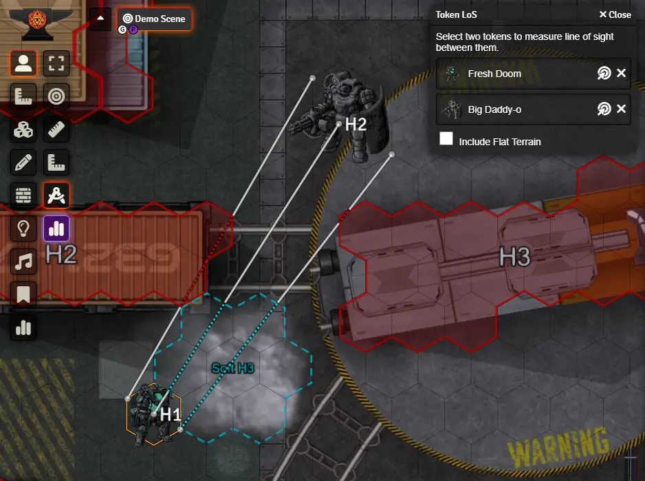
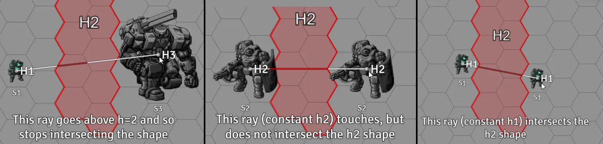

# Terrain Height Tools

 
[)](https://github.com/Wibble199/FoundryVTT-Terrain-Height-Tools/releases/latest)
[)](https://github.com/Wibble199/FoundryVTT-Terrain-Height-Tools/releases/latest)

Tools for painting grid cells with terrain heights and calculating line of sight with respect to these heights.

Designed for LANCER, _Terrain Height Tools_ takes inspiration from the way painting tiles works in the _[Political Map Overlay](https://github.com/cirrahn/foundry-polmap)_ module by cirrahn; and augments it with some line of sight calculation functionality and the ability to render the heights on the token layer.

## Installation

Simply search for 'Terrain Height Tools' in the Foundry 'Install Module' screen and install it from there.

Alternatively, paste this URL into the 'Manifest URL' field of the 'Install Module' dialog in the Foundry configuration: `https://github.com/Wibble199/FoundryVTT-Terrain-Height-Tools/releases/latest/download/module.json`, then enable the module in your world.

> [!IMPORTANT]
> Note that the latest version this module currently only supports Foundry v11.x.
>
> The latest version that supports Foundry v10.x is [v0.1.4](https://github.com/Wibble199/FoundryVTT-Terrain-Height-Tools/releases/tag/v0.1.4)

## Usage

Once installed, the first thing you need to do is configure the paintable terrain types for your world. You can think of terrain types like colours of paint for your paintbrush. This can be done either by:
- Going on to '_Configure Settings_' in the Foundry right-hand menu, clicking '_Terrain Height Tools_' on the navigation list, then clicking the 'Configure Terrain Types' button.
- Alternatively, you can click the new '_Terrain Height Tools_' button on the scene controls (icon is 3 vertical bars of different heights), selecting the '_Paint_' tool (icon is a paintbrush), and clicking the cog button on the top right of the '_Terrain Palette_' window that appears.

See [below](#configuring-terrain-types) for more details about configuring terrain types.

Once at least one type of terrain has been configured, you can then use the tools in the '_Terrain Height Tools_' menu to paint terrain onto the map. To do this, you need to click the type of terrain you want to paint in the '_Terrain Palette_' window and choose a height for the terrain. You can also optionally enter an elevation. Adjacent grid cells will merge together if their terrain types, their heights, and their elevations are the same.

### Line of Sight

Terrain Height Tools provides two tools for testing line of sight (LoS) against the terrain that has been drawn to the scene. Both of them can be found under the tokens menu.

The first, is the humble '_Line of Sight Ruler_'. The ruler behaves similarlly to the standard ruler built in to Foundry. You can click and drag between two points, and it will test the line of sight along this line, and highlight any intersections with the terrain. You will also see a 'H' number next to either end of the ruler. This represents the height of that endpoint. You can change this either by using the `+` and `-` keys on your keyboard, or typing values into the config window that appears.

The second tool is the '_Token Line of Sight_' tool. When you click this tool, you will see a config window appear. Click on the bullseye icon and then click on a token on the scene, for both the boxes that appear. Terrain Height Tools will then draw 3 LoS rays: one from the centre of the first token to the centre of the second; one between the left-most edges of the tokens; and one between the right-most edges. The H value of these lines depends on how the LoS is configured, but it is based on the token's elevation + a modifier multiplied by the token's width (there is no 'vertical height' field for tokens in Foundry, so tokens are assumed to be as tall as they are wide); For example in the default configuration a token with an elevation of 3 and a size of 2, the H would be 5; This represents the top of the token. The tool can instead draw the LoS from the middle or the bottom of a token.

When the LoS rays are drawn to the scene, you will see a line drawn from the source point to the target point. This line is formatted depending on what state it is in at that point:
- A solid white line means that the line is not intersecting with anything.
- A coloured line means that the line is touching or intersecting with some terrain. The colour matches the terrain's colour.
	- If a coloured line is solid, it means that the ray touches a terrain shape, but does not actually intersect it.
	- If a coloured line is dashed, it means that the ray completely intersects a shape.

It's also worth noting that the ray is calculated in 3D space, so if you see it abruptly stop intersecting a shape part way through, it has likely impacted the top or bottom of the shape.

### Configuring Terrain Types

To add a new terrain type simply:
1. Click the "Add Terrain Type" button in the bottom left.
2. Give it a name (labelled 2 in the above image). Note that this is what shows in the palette window, NOT what is shown to players on the scene canvas.
3. Select whether or not the terrain type should have a height/elevation.
	- This is the default, however for some types (e.g. objective/control zones) it may not make sense to give them a height. This setting will disable the height option in the palette, and prevent you from accidentally having areas with different heights. Note that disabling this will NOT affect already-painted grid cells.
4. Select whether or not the terrain type should be considered 'solid'. At the moment this is only used for the optional functionality to change a token's elevation when moving over terrain; If the terrain type is considered non-solid, then tokens will be able to pass through it (e.g. smoke/dust).
5. Configure the style of the area that will be painted on the scene - these settings should be familiar if you have used the default Foundry drawing tool before.
	- One thing to note though is that the '_Text Label_' (number 8 in the above image), which is what the area will be labelled as, allows a `%h%` and/or a `%e%` placeholder to be used. These will be replaced with the height or elevation value of the painted terrain respectively. For example, if you create a type with a label of `H%h%`, when painted on the scene at height 2, it will have a label of `H2`. If painted at height 4, it will have a label of `H4`, etc. Likewise, a label of `H%h%+%e%` would show `H3+4` if it was a height 3 terrain at an elevation of 4.
6. Click '_Save Changes_' in the bottom right, and your new terrain type will show up in the palette.

There are some other useful buttons:
- Button 1 expands/collapses the terrain type configuration. Just helps keep the menu tidy!
- Buttons 3 and 4 on the above image are to move the terrain types up and down. This only affects their order in the palette, but you can shift your most-used terrain types to the top if you wish.
- Button 5 allows you to duplicate an existing terrain type, copying all the configuration.
- Button 6 is to delete the terrain type.
- '_Import Preset_' (button 9) allows you to easily import a config preset that has been submitted by members of the community. If you would like to submit a preset, please create an issue or pull request on GitHub.
- '_Import JSON_' (button 10) allows you to paste JSON in to import some terrain types that have been exported previously.
- '_Export JSON_' (button 11) will give you a JSON that you can share with other people, or copy to other worlds and will copy all your terrain types.

### Module Settings

Here is a quick reference of the settings module presents in the 'Configure Settings' button of Foundry:

#### All Users

- `Terrain Height Map Visibility Radius` - If not zero, the terrain height map will only be shown in a radius of that many grid cells around the mouse cursor. If zero, the entire map will be visible.
- `Other User's LoS Ruler Opacity` - How opaque/transparent other user's line of sight rulers will appear to you.
- `Token LoS: Auto-populate Primary Token` - If true, when selecting the Token Line of Sight tool, THT will attempt to populate the first token for LoS measurement. It will prioritise a selected token on the scene if you have one, or if there isn't one it'll attempt to fallback to the token that represents the actor you have configured as your character.
- `Token LoS: Auto-populate Secondary Token` - If true, when selecting the Token Line of Sight tool, THT will attempt to populate the second token for LoS measurement. It will use the first targeted token on the scene, if there is one.
- `Automatic Token Elevation Change` - If true, when you move tokens, the token's elevation will be adjusted when moved over terrain. The relative height above the ground for a token is maintained. For example, if a token was at elevation 1, when moving it over H2 terrain, it's elevation will become 3. Non-solid terrain is excluded from this. If the token occupies multiple different terrains, the highest one takes precedence.

#### GM Only

- `Terrain Types` - Button to open the terrain type configuration (see [above](#configuring-terrain-types))
- `Terrain Height Map Above Tiles` - This determines whether or not the terrain height map is shown above or below ground-level tiles. The height map is ALWAYS shown below overhead tiles. This can also be configured on a per-scene basis using the 'Terrain Height Map Layer' option on the 'Grid' tab of the scene config settings.
- `Display Line of Sight Ruler (GM)` - If true, the GM's Line of Sight measurements will be shown to other players.
- `Display Line of Sight Ruler (Player)` - If true, players' Line of Sight measurements will be shown to other players.

## API

Terrain Height Tools exposes an API that can be used by macros, scripts or, other modules. Please see the [API documentation](/docs/api.md) for more.
