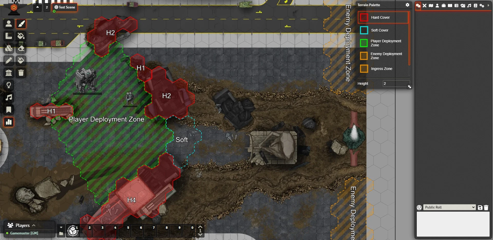
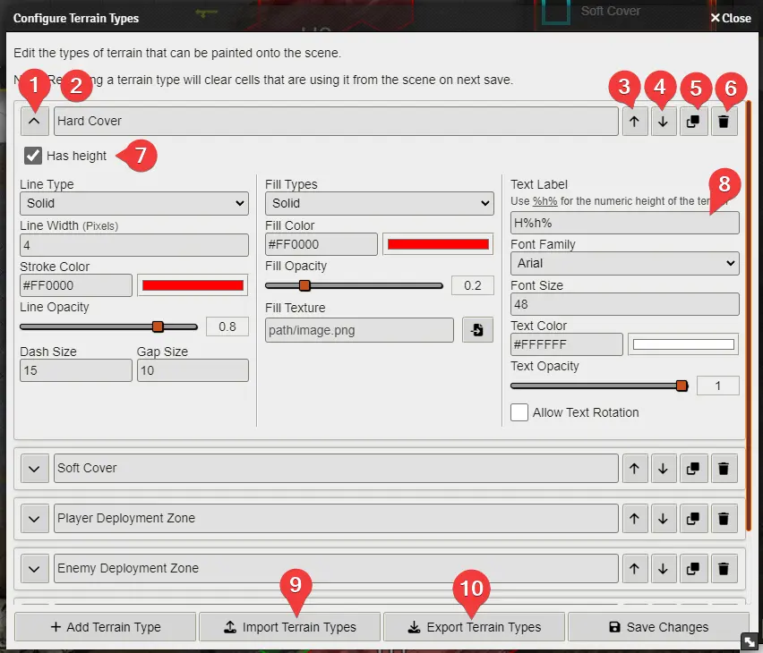

# Terrain Height Tools (Foundry v10)

Tools for painting grid cells with terrain heights and calculating line of sight with respect to these heights.

Designed for LANCER, _Terrain Height Tools_ takes inspiration from the way painting tiles works in the _[Political Map Overlay](https://github.com/cirrahn/foundry-polmap)_ module by cirrahn; and augments it with some line of sight calculation functionality and the ability to render the heights on the token layer.

## Installation

Paste this URL into the 'Manifest URL' field of the 'Install Module' dialog in the Foundry configuration: `https://github.com/Wibble199/FoundryVTT-Terrain-Height-Tools/releases/latest/download/module.json`, then enable the module in your world.

Note that this module currently only supports Foundry v10.x.

## Usage

Once installed, the first thing you need to do is configure the paintable terrain types for your world. You can think of terrain types like colours of paint for your paintbrush. This can be done either by:
- Going on to '_Configure Settings_' in the Foundry right-hand menu, clicking '_Terrain Height Tools_' on the navigation list, then clicking the 'Configure Terrain Types' button.
- Alternatively, you can click the new '_Terrain Height Tools_' button on the scene controls (icon is 3 vertical bars of different heights), selecting the '_Paint_' tool (icon is a paintbrush), and clicking the cog button on the top right of the '_Terrain Palette_' window that appears.

See [below](#configuring-terrain-types) for more details about configuring terrain types.

Once at least one type of terrain has been configured, you can then use the tools in the '_Terrain Height Tools_' menu to paint terrain onto the map. To do this, you need to click the type of terrain you want to paint in the '_Terrain Palette_' window and choose a height for the terrain. Adjacent grid cells will merge together if both their terrain types and their heights are the same.

## Configuring Terrain Types

To add a new terrain type simply:
1. Click the "Add Terrain Type" button in the bottom left.
2. Give it a name (labelled 2 in the above image). Note that this is what shows in the palette window, NOT what is shown to players on the scene canvas.
3. Select whether or not the terrain type should have a height.
	- This is the default, however for some types (e.g. objective/control zones) it may not make sense to give them a height. This setting will disable the height option in the palette, and prevent you from accidentally having areas with different heights. Note that disabling this will NOT affect already-painted grid cells.
4. Configure the style of the area that will be painted on the scene - these settings should be familiar if you have used the default Foundry drawing tool before.
	- One thing to note though is that the '_Text Label_' (number 8 in the above image), which is what the area will be labelled as, allows a `%h%` placeholder to be used. This will be replaced with the height value of the painted terrain. For example, if you create a type with a label of `H%h%`, when painted on the scene at height 2, it will have a label of `H2`. If painted at height 4, it will have a label of `H4`, etc.
5. Click '_Save Changes_' in the bottom right, and your new terrain type will show up in the palette.

There are some other useful buttons:
- Button 1 expands/collapses the terrain type configuration. Just helps keep the menu tidy!
- Buttons 3 and 4 on the above image are to move the terrain types up and down. This only affects their order in the palette, but you can shift your most-used terrain types to the top if you wish.
- Button 5 allows you to duplicate an existing terrain type, copying all the configuration.
- Button 6 is to delete the terrain type.
- '_Import Terrain Types_' (button 9) allows you to paste JSON in to import some terrain types that have been exported previously.
- '_Export Terrain Types_' (button 10) will give you a JSON that you can share with other people, or copy to other worlds and will copy all your terrain types.

## Module Settings

Here is a quick reference of the settings module presents in the 'Configure Settings' button of Foundry:

- `Terrain Types` - GM Only - Button to open the terrain type configuration (see [above]((#configuring-terrain-types)))
- `Terrain Height Map Above Tiles` - GM Only - This determines whether or not the terrain height map is shown above or below ground-level tiles. The height map is ALWAYS shown below overhead tiles. This can also be configured on a per-scene basis using the 'Terrain Height Map Layer' option on the 'Grid' tab of the scene config settings.
- `Terrain Height Map Visibility Radius` - Per Player - If not zero, the terrain height map will only be shown in a radius of that many grid cells around the mouse cursor. If zero, the entire map will be visible.
