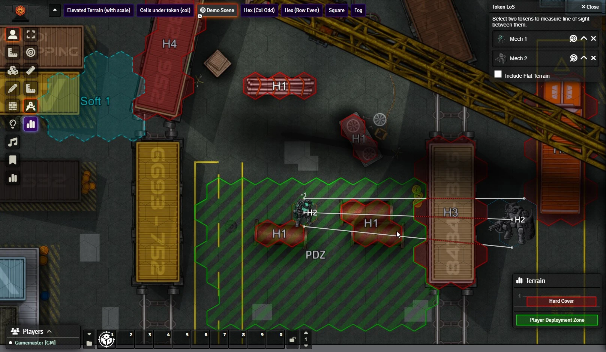
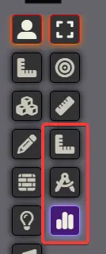

# Terrain Height Tools

 
[)](https://github.com/Wibble199/FoundryVTT-Terrain-Height-Tools/releases/latest)
[)](https://github.com/Wibble199/FoundryVTT-Terrain-Height-Tools/releases/latest)

Tools for painting grid cells with terrain heights and calculating line of sight with respect to these heights.

Designed for LANCER, _Terrain Height Tools_ takes inspiration from the way painting tiles works in the _[Political Map Overlay](https://github.com/cirrahn/foundry-polmap)_ module by cirrahn; and augments it with some line of sight calculation functionality and the ability to render the heights on the token layer.

## Installation

Simply search for 'Terrain Height Tools' in the Foundry 'Install Module' screen and install it from there.

Alternatively, paste this URL into the 'Manifest URL' field of the 'Install Module' dialog in the Foundry configuration: `https://github.com/Wibble199/FoundryVTT-Terrain-Height-Tools/releases/latest/download/module.json`, then enable the module in your world.

## Usage

> [!TIP]
> [If you're a GM, read this getting started guide first.](./docs/getting-started-gm.md)

### Token Controls Toolbox

Terrain Height Tools will add three new tools to the Token Controls toolbox:

The first is the _Line of Sight Ruler_. This tool works very similarly to the regular Foundry ruler, except that it will determine if a ray drawn from one point on the map to another intersects any terrain. With the tool selected, you can press the <kbd>+</kbd>/<kbd>-</kbd> keys on the keyboard (these can be changed in Foundry's _Configure Controls_ menu) to change the starting elevation of the ray. Then, position your mouse where you want the ray to start (hold <kbd>Shift</kbd> to prevent snapping) and drag your mouse around. The end elevation of the ray follows the start elevation by default, but you can press <kbd>+</kbd>/<kbd>-</kbd> again to change this. You can also use the toolbox window that appears to manually enter the elevation if you prefer.

The ruler will show as an unbroken white line where it is not intersecting any terrain, a coloured unbroken line where it is touching (but not intersecting) terrain, or a coloured dashed line where it is intersecting terrain. The colour of the line will match the colour of the terrain being intersected.

The second tool is the _Token Line of Sight_ tool, and it is for quickly testing line of sight between two tokens. When you select this tool, A toolbox window will appear that will allow you to select two tokens. Click on the target icon, then click on a token on the scene to select it. Terrain Height Tools will then draw three rays, one between the centres of both tokens, and one from either side of the tokens. The rules for how each of these ruler is coloured is the same as the line of sight ruler (see above).

By default, THT will draw these rays from the top of one token to the top of the other. You can change this for each token by clicking on the chevron icon next to the target icon. An up chevron (default) means the top of the token, a horizontal line means the half way point of a token, and a down chevron means the bottom of the token. Note that this will take the token's elevation into account too.

When you first open this tool, if you have an own token or a selected token on the scene, this will automatically be your first token (though you can still change it ofcourse). Similarly, if you have a token targetted, this will be your second token.

> [!INFO]
> Both the Line of Sight Ruler and the Token Line of Sight tool work in 3D. If you see colours changing part way through a terrain object, the ray is likely entering/existing the top or bottom of the object.

The third button in the toolbox is a button to quickly turn the terrain map on or off. If you can't see any terrain, check this is turned on! Note that your GM may have configured some terrain to always show, regardless of this setting.

### Visibility Radius

Another popular feature of THT is the _Terrain Height Map Visibility Radius_ option in the settings. By default this is turned off (value of 0), but if you change this to a positive number, the terrain height map will only show in a certain radius around your cursor. This can help keep your screen looking tidy!

Holding the <kbd>Alt</kbd> key will show the entire map.

Note that your GM may have configured some terrain to always show, even when not near your mouse.

### Terrain Viewer

Another useful feature that was released with v0.4.0 is the _Terrain Viewer_. This is a small window that appears in the bottom right of your screen and will show you a side view of the terrain. This can be useful if there are multiple stacked terrain types.

By default this is turned off unless you hold the keybinding to show it (default <kbd>Q</kbd>), but you can turn it on permanently if you wish.

## See Also
- [Settings & Keybinds Reference](./docs/settings-keybinds-reference.md)
- [API Reference (for macros and modules)](./docs/api.md)
